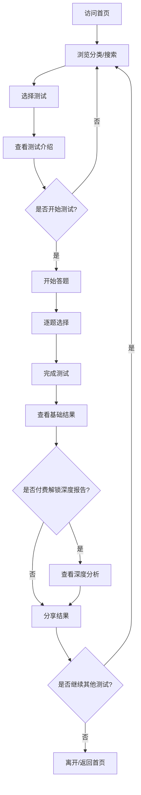

# 趣味测试平台 - 产品需求文档

## 1. 产品概述

这是一个集成了50多种心理测试、趣味测试、星座分析等功能的综合性在线娱乐平台。平台融合了当下最流行的MBTI、SBTI人格测试、星座配对分析、关系测试等热门功能，为用户提供深度的自我探索和社交互动体验。

目标用户为18-35岁的年轻用户群体，特别是对心理学、星座文化、自我探索感兴趣的人群。平台旨在通过科学和趣味结合的方式，帮助用户了解自我、探索人际关系，并通过社交分享功能增强用户互动。

## 2. 核心功能

### 2.1 用户角色

| 角色 | 注册方式 | 核心权限 |
|------|---------|---------|
| 普通用户 | 无需注册即可使用 | 浏览和参与所有测试功能，查看基础结果 |
| 注册用户 | 邮箱/社交账号注册 | 保存测试历史，创建自定义测试，解锁高级报告，参与社区互动 |
| VIP用户 | 付费订阅 | 解锁所有深度分析报告，AI个性化解读，无限次测试，专属测试 |

### 2.2 功能模块分类

#### A类：人格与心理测试模块（15个功能）

1. **MBTI人格测试系统**
   - 93题专业版MBTI测试
   - 16种人格类型详细解读
   - 四维度得分可视化
   - 职业匹配建议
   - 人际关系指导

2. **SBTI趣味人格测试**
   - 31题快速测试
   - 27种网络梗人格类型
   - "吗喽"、"死者"、"伪人"等趣味标签
   - 15维度雷达图分析
   - 极强社交分享属性

3. **Big Five科学人格测试**
   - OCEAN五维度评估
   - 科学心理学依据
   - 百分位对比数据
   - 专业心理报告

4. **九型人格（Enneagram）测试**
   - 9种核心类型 + 翅膀类型
   - 深层动机分析
   - 发展路径建议

5. **DISC行为风格测试**
   - 职场行为分析
   - 团队协作建议
   - 沟通风格指导

6. **脑型测试（左脑/右脑）**
   - 认知风格分析
   - 思维偏好诊断
   - 学习方法建议

7. **色彩性格测试**
   - 色彩心理学分析
   - 直觉选择测试
   - 情绪状态映射

8. **动物人格测试**
   - 趣味动物类比
   - 性格特征可视化
   - 生动形象解读

9. **HSP高敏感人群测试**
   - 高敏感特质评估
   - 生活适应建议
   - 环境敏感性分析

10. **依恋类型测试**
    - 四种依恋风格
    - 关系模式分析
    - 情感修复指导

11. **情绪智力（EQ）测试**
    - 五大情商维度
    - 社交能力评估
    - 情绪管理建议

12. **压力指数测试**
    - 当前压力水平
    - 压力来源分析
    - 缓解策略建议

13. **自尊水平测试**
    - 自我价值感评估
    - 自信度分析
    - 提升方案建议

14. **心理韧性测试**
    - 抗压能力评估
    - 恢复力分析
    - 成长型思维指导

15. **内耗指数测试**
    - 精神消耗评估
    - 思维模式分析
    - 节能生活建议

#### B类：星座与神秘学模块（12个功能）

16. **星座完整分析系统**
    - 12星座详细性格解读
    - 三大特质分析（太阳、月亮、上升）
    - 星座元素属性
    - 星座守护星解读

17. **星座配对分析**
    - 爱情、友情、事业三维度配对
    - 详细配对指数
    - 相处建议
    - 化解冲突方案

18. **AI星座智能解读**
    - 基于完整星盘的AI分析
    - 实时运势预测
    - 个性化建议
    - 十种语言支持

19. **月亮星座深度分析**
    - 内在情感需求
    - 潜意识动机
    - 情绪表达模式

20. **上升星座分析**
    - 外在形象塑造
    - 第一印象分析
    - 人际交往风格

21. **行星位置分析**
    - 各行星影响解读
    - 金星（爱情）、火星（行动）、木星（运气）等
    - 宫位影响分析

22. **星座运势预测**
    - 日、周、月、年运势
    - 爱情、事业、财运分项
    - 关键日期提醒

23. **星盘生成器**
    - 完整出生星盘绘制
    - 宫位划分
    - 行星相位分析
    - 视觉化展示

24. **塔罗牌占卜系统**
    - 78张塔罗牌完整库
    - 多种牌阵选择
    - AI解读系统
    - 生活问题指导

25. **生命灵数分析**
    - 命数计算与解读
    - 命运路径分析
    - 天赋数字解读

26. **脉轮能量测试**
    - 7大脉轮状态评估
    - 能量平衡建议
    - 灵性成长指导

27. **气场颜色测试**
    - 能量场颜色分析
    - 当前状态解读
    - 能量调整建议

#### C类：关系与情感测试模块（10个功能）

28. **恋爱风格测试**
    - 五种恋爱类型
    - 表达方式分析
    - 伴侣匹配建议

29. **爱情语言测试**
    - 五种爱的语言识别
    - 情感需求分析
    - 关系改善建议

30. **关系满意度评估**
    - 当前关系质量
    - 问题区域识别
    - 优化方案建议

31. **友情质量测试**
    - 朋友关系评估
    - 互动模式分析
    - 友谊维护建议

32. **家庭关系测试**
    - 家庭氛围评估
    - 成员相处分析
    - 家庭和谐建议

33. **人际关系风格测试**
    - 社交倾向分析
    - 人际互动模式
    - 社交策略建议

34. **信任度测试**
    - 信任能力评估
    - 信任模式分析
    - 信任建立指导

35. **沟通风格测试**
    - 沟通方式分析
    - 表达倾听评估
    - 沟通改进建议

36. **亲密关系恐惧测试**
    - 亲密障碍识别
    - 情感防御分析
    - 开放心扉指导

37. **心动指数测试**
    - 对某人的好感度评估
    - 情感状态识别
    - 关系发展建议

#### D类：趣味娱乐测试模块（8个功能）

38. **"你是哪个动漫角色"测试**
    - 流行动漫人物库
    - 性格匹配算法
    - 角色详细对比

39. **"你是哪种动物"测试**
    - 50+动物类型库
    - 行为特征类比
    - 生存本能分析

40. **"你的前世是谁"测试**
    - 时空穿越设定
    - 角色扮演体验
    - 趣味故事生成

41. **"你在团队中的角色"测试**
    - 团队角色定位
    - 协作风格分析
    - 领导力评估

42. **"你的隐藏技能是什么"测试**
    - 潜能发现
    - 技能树建议
    - 发展路径指导

43. **"荒岛求生测试"**
    - 生存策略分析
    - 应急反应评估
    - 决策能力测试

44. **"你的灵魂颜色"测试**
    - 精神能量映射
    - 灵性特质分析
    - 生命使命解读

45. **"平行世界身份"测试**
    - 异世界设定
    - 新身份构建
    - 趣味人生体验

#### E类：职业与发展测试模块（6个功能）

46. **职业兴趣测试**
    - Holland职业类型
    - 兴趣领域匹配
    - 职业路径建议

47. **职场价值观测试**
    - 工作价值观排序
    - 职业满意度预测
    - 企业文化匹配

48. **领导力评估**
    - 领导风格识别
    - 管理能力分析
    - 团队建设建议

49. **创业潜能测试**
    - 创业特质评估
    - 商业思维分析
    - 风险承受度

50. **学习能力测试**
    - 学习风格识别
    - 认知优势分析
    - 学习策略建议

51. **时间管理能力测试**
    - 时间使用效率
    - 优先级判断
    - 计划能力评估

#### F类：生活方式测试模块（4个功能）

52. **生活习惯测试**
    - 生活规律评估
    - 健康度分析
    - 改善建议

53. **睡眠质量测试**
    - 睡眠模式评估
    - 睡眠障碍识别
    - 改善方案建议

54. **消费风格测试**
    - 消费习惯分析
    - 财务风格评估
    - 消费优化建议

55. **旅行风格测试**
    - 旅行偏好分析
    - 目地匹配建议
    - 旅行计划指导

### 2.3 页面详情

| 页面名称 | 模块名称 | 功能描述 |
|---------|---------|---------|
| 首页 | Hero区域 | 动态背景展示平台特色，热门测试轮播，快速入口 |
| 首页 | 功能分类导航 | 6大功能类别卡片展示，悬浮动画效果，快速筛选 |
| 首页 | 热门测试推荐 | 基于用户热度的测试推荐，排行榜展示 |
| 首页 | 最新测试展示 | 新上线功能展示，尝鲜体验入口 |
| 测试列表页 | 分类筛选 | 左侧分类树形结构，右侧测试卡片网格布局 |
| 测试列表页 | 搜索功能 | 搜索框，关键词匹配，智能推荐 |
| 测试列表页 | 标签系统 | 热门标签云，点击快速筛选 |
| 单个测试页 | 测试介绍 | 测试说明、题目数量、预计时间、理论基础 |
| 单个测试页 | 答题界面 | 进度条、题目展示、选项动画、回退功能 |
| 单个测试页 | 计分系统 | 实时计分、维度统计、算法处理 |
| 结果页 | 结果展示 | 测试结果可视化、维度雷达图、详细解读 |
| 结果页 | 分享功能 | 一键分享到社交媒体、生成精美卡片、复制链接 |
| 结果页 | 深度报告 | 高级分析报告（付费功能）、AI个性化解读 |
| 结果页 | 相关推荐 | 相关测试推荐、深入探索路径 |
| 用户中心 | 测试历史 | 已完成测试记录、结果查看、进度保存 |
| 用户中心 | 收藏夹 | 收藏的测试、待做清单 |
| 用户中心 | 个人资料 | 基本信息、偏好设置、主题切换 |
| 社区互动 | 结果讨论 | 测试结果评论区、经验分享 |
| 社区互动 | 类型匹配 | 同类型用户匹配、交流群组 |
| 自定义测试 | 创建工具 | 创建个人测试、邀请好友测试"谁最懂你" |
| 自定义测试 | 分享挑战 | 邀请好友答题、查看好友得分、排行榜 |

## 3. 核心流程

### 3.1 主要用户流程

用户进入平台 → 浏览测试分类或搜索特定测试 → 选择感兴趣的测试 → 查看测试介绍 → 开始答题 → 逐题选择答案 → 完成测试 → 查看基础结果 → 可选：分享结果到社交媒体 → 可选：解锁深度付费报告 → 可选：查看相关测试推荐 → 继续探索其他测试

### 3.2 流程图

### 3.3 自定义测试流程

用户注册/登录 → 进入自定义测试创建页 → 输入测试标题 → 创建个人问题（9道） → 设置正确答案 → 生成专属链接 → 分享到社交平台 → 好友接收链接 → 好友答题 → 查看好友得分排行 → 社交互动

## 4. 用户界面设计

### 4.1 设计风格

**主题色彩方案：**
- 主色调：渐变紫蓝色系 (#6366F1 到 #8B5CF6)
- 次色调：渐变粉橙色系 (#EC4899 到 #F97316)
- 背景色：深色模式（#0F172A）与浅色模式（#F8FAFC）
- 强调色：金黄渐变 (#FBBF24 到 #F59E0B)

**视觉元素：**
- 大量使用渐变背景和霓虹光效
- 悬浮卡片设计，毛玻璃效果
- 动态粒子背景和流动动画
- 立体感按钮，3D阴影效果
- 圆角设计，柔和边缘

**字体系统：**
- 标题：使用粗体、大字号、特色字体（如思源黑体Bold）
- 正文：舒适阅读字体（如思源黑体Regular）
- 装饰：emoji和图标大量使用
- 多语言支持字体

**布局风格：**
- 卡片式布局，响应式网格
- 悬浮导航栏，固定顶部
- 左侧边栏分类导航（桌面端）
- 底部导航栏（移动端）
- 弹窗式测试界面

**图标与装饰：**
- 使用精致的SVG图标
- 星星、魔法棒、水晶球等神秘元素
- 流行emoji表情符号
- 动态加载动画

### 4.2 页面设计概述

| 页面名称 | 模块名称 | UI元素与设计特点 |
|---------|---------|-----------------|
| 首页 | Hero区域 | 全屏渐变背景，动态星空粒子效果，大标题悬浮动画，主CTA按钮带光效脉冲 |
| 首页 | 功能分类 | 6个大型卡片，每个卡片独特渐变色，悬浮时3D翻转效果，分类图标闪烁 |
| 首页 | 热门测试 | 轮播卡片，自动滑动，热度指标闪烁，测试图标动态跳动 |
| 测试列表页 | 整体布局 | 深色背景，测试卡片网格布局，卡片悬浮上浮效果，边框光晕 |
| 测试列表页 | 筛选系统 | 左侧树形菜单，展开收起动画，选中项高亮发光，标签云动态排列 |
| 单个测试页 | 介绍区 | 测试封面图，介绍文字，预计时长，难度星级，开始按钮发光脉动 |
| 单个测试页 | 答题区 | 题目卡片居中，选项按钮排列，选项悬浮变色，选中后动画反馈，进度条渐变 |
| 单个测试页 | 计分系统 | 隐藏式后台计算，实时维度统计，维度可视化（小雷达图） |
| 结果页 | 结果展示 | 大型结果卡片，雷达图/柱状图可视化，结果类型标题闪烁，详细解读分段展示 |
| 结果页 | 分享按钮 | 多平台分享图标，分享按钮带动画效果，生成精美卡片预览，复制链接反馈 |
| 结果页 | 付费解锁 | 高级报告预览区，解锁按钮金色发光，会员特权说明，支付流程引导 |
| 用户中心 | 整体设计 | 个人头像区，已完成测试时间线，收藏测试列表，设置面板，主题切换开关 |
| 社区互动 | 讨论区 | 评论卡片列表，用户头像，评论内容，点赞动画，回复功能 |

### 4.3 响应式设计

**桌面优先设计策略：**
- 主要为桌面端优化（1920x1080及以上）
- 大屏幕充分利用宽屏优势，展示更多内容
- 左侧固定导航栏，右侧内容区域
- 多列网格布局，充分利用空间

**移动端适配：**
- 响应式布局，单列卡片
- 底部固定导航栏
- 答题界面全屏化
- 简化动画以提升性能
- 触控优化，按钮尺寸加大

**平板适配：**
- 两列卡片布局
- 悬浮侧边栏
- 平衡的动画效果

### 4.4 动画与交互指导

**页面加载动画：**
- 闪烁的星星/魔法元素
- 渐进式内容揭示
- 悬浮卡片依次出现

**按钮交互：**
- 悬浮时发光增强
- 点击时收缩反馈
- 加载时旋转动画

**答题交互：**
- 选项选中时颜色填充动画
- 题目切换时平滑过渡
- 进度条渐变填充

**结果揭示：**
- 雷达图逐维度展开
- 文字分段出现
- 数字计数动画

**社交分享：**
- 分享按钮脉动
- 卡片生成动画
- 成功提示闪烁

## 5. 技术要求

### 5.1 性能要求

- 首页加载时间 < 2秒
- 测试答题页面切换 < 500ms
- 结果计算和展示 < 1秒
- 支持并发用户数 > 10,000
- 图片和动画资源优化（压缩、懒加载）

### 5.2 兼容性要求

- 支持主流浏览器（Chrome, Firefox, Safari, Edge）
- 支持iOS和Android移动设备
- 支持平板设备
- 支持深色模式系统偏好

### 5.3 数据安全要求

- 用户数据加密存储
- 测试结果隐私保护
- 支付流程安全（SSL加密）
- 符合GDPR数据保护规范

### 5.4 SEO与社交优化

- 每个测试页面独立SEO优化
- Open Graph标签完整
- 结构化数据标记
- 社交分享预览优化

## 6. 商业模式

### 6.1 收费模式

**免费功能：**
- 所有基础测试功能
- 基础结果展示
- 基础分享功能

**付费解锁：**
- 单次深度报告解锁（9.9-19.9元）
- 月度会员订阅（29.9元/月）
- 年度会员订阅（199元/年）

**VIP特权：**
- 所有测试无限次深度报告
- AI个性化解读
- 专属测试功能
- 优先客服支持

### 6.2 营销推广

- 社交媒体营销（小红书、微博、抖音）
- KOL合作推广
- SEO优化引流
- 用户裂变机制（分享奖励）

## 7. 未来规划

### 7.1 短期规划（3-6个月）

- 完成50+基础功能上线
- 用户注册系统完善
- 社交分享功能优化
- 初步付费系统搭建

### 7.2 中期规划（6-12个月）

- AI智能解读系统升级
- 用户社区功能完善
- 移动App开发
- 多语言国际化

### 7.3 长期规划（1-2年）

- 企业版B端服务
- 心理咨询师对接平台
- VR沉浸式测试体验
- 全球化运营