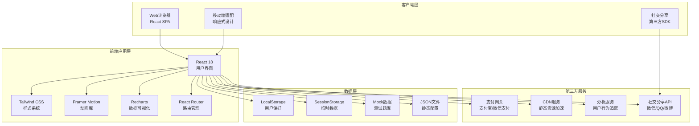

# 趣味测试平台 - 技术架构文档

## 1. 架构设计

本平台采用现代化的全栈架构，前端使用React生态系统，后端采用轻量级架构，数据存储采用混合方案。



## 2. 技术栈描述

### 2.1 前端技术栈

**核心框架与库：**
- **React 18** - 核心UI框架，使用函数组件和Hooks
- **Vite** - 现代化构建工具，快速开发和构建
- **Tailwind CSS 3** - 实用优先的CSS框架，自定义设计系统
- **TypeScript** - 类型安全，提升代码质量

**UI与交互库：**
- **Framer Motion** - 高性能动画库，用于页面过渡和交互反馈
- **Recharts** - React图表库，用于雷达图、柱状图等可视化
- **React Router v6** - 前端路由管理，支持动态路由
- **React Helmet** - SEO优化，管理meta标签

**状态管理：**
- **React Context** - 全局状态管理（用户信息、测试状态）
- **useReducer** - 复杂状态逻辑管理
- **useState/useEffect** - 本地组件状态

**工具库：**
- **lodash** - 通用工具函数
- **dayjs** - 日期处理
- **clsx** - CSS类名组合

### 2.2 后端与数据（轻量化方案）

**数据存储方案：**
- **JSON静态文件** - 测试题库、星座数据、结果解读等静态数据
- **LocalStorage** - 用户偏好设置、已完成测试记录
- **SessionStorage** - 当前测试进度、临时答题数据

**可选轻量后端（Phase 2）：**
- **Express.js** - 简单API服务
- **SQLite** - 用户注册、付费记录持久化存储

### 2.3 开发工具

- **ESLint + Prettier** - 代码规范和格式化
- **Git** - 版本控制
- **pnpm** - 包管理器（性能优于npm/yarn）

## 3. 路由定义

| 路径 | 页面名称 | 功能说明 | 参数 |
|------|---------|---------|------|
| `/` | 首页 | 展示平台介绍、热门测试、分类导航 | 无 |
| `/tests` | 测试列表页 | 所有测试列表、分类筛选、搜索 | `?category=A&type=mbti` |
| `/test/:testId` | 测试详情页 | 单个测试介绍、开始测试入口 | `testId: mbti` |
| `/test/:testId/start` | 答题页面 | 测试答题界面、进度展示 | `testId: mbti` |
| `/test/:testId/result/:sessionId` | 结果页面 | 测试结果展示、分享、付费解锁 | `testId, sessionId` |
| `/user` | 用户中心 | 用户资料、测试历史、收藏（需登录） | 无 |
| `/user/history` | 测试历史 | 已完成测试列表、结果查看 | 无 |
| `/custom/create` | 自定义测试创建 | 创建个人测试、生成链接 | 无 |
| `/custom/:customId` | 自定义测试挑战 | 好友答题、查看排行 | `customId` |
| `/pricing` | 付费方案页 | VIP会员介绍、价格方案 | 无 |
| `/about` | 关于我们 | 平台介绍、联系方式 | 无 |

**路由守卫逻辑：**
- 用户中心相关路由需检查登录状态
- 结果页面需验证sessionId有效性
- 付费相关路由需检查VIP状态

## 4. API设计（轻量版）

### 4.1 静态数据API（JSON文件模拟）

```typescript
// 测试题库数据结构
interface TestQuestion {
  id: string;
  testId: string;
  questionNumber: number;
  questionText: string;
  options: TestOption[];
  dimensions?: string[]; // 涉及的维度
  imageUrl?: string;
}

interface TestOption {
  id: string;
  text: string;
  scores: Record<string, number>; // 各维度得分
  imageUrl?: string;
}

// 测试结果数据结构
interface TestResult {
  id: string;
  testId: string;
  resultType: string; // 如 MBTI的 "INTJ"
  resultTitle: string;
  resultDescription: string;
  dimensionScores: Record<string, number>;
  detailedAnalysis?: string;
  recommendations?: string[];
  imageUrl?: string;
}

// 测试元信息
interface TestMeta {
  id: string;
  name: string;
  category: string; // A/B/C/D/E/F
  description: string;
  questionCount: number;
  estimatedTime: number; // 分钟
  difficulty: number; // 1-5星
  popularity: number;
  tags: string[];
  isFree: boolean;
  premiumPrice?: number;
  thumbnailUrl: string;
  colorTheme: string[];
}
```

### 4.2 本地数据管理API

```typescript
// LocalStorage管理
class LocalStorageAPI {
  // 保存用户偏好
  saveUserPreference(key: string, value: any): void;
  
  // 获取用户偏好
  getUserPreference(key: string): any;
  
  // 保存测试历史
  saveTestHistory(testRecord: TestRecord): void;
  
  // 获取测试历史
  getTestHistory(): TestRecord[];
  
  // 保存收藏测试
  saveFavoriteTest(testId: string): void;
  
  // 获取收藏列表
  getFavoriteTests(): string[];
}

// SessionStorage管理
class SessionStorageAPI {
  // 保存当前测试进度
  saveTestProgress(sessionId: string, progress: TestProgress): void;
  
  // 获取测试进度
  getTestProgress(sessionId: string): TestProgress;
  
  // 清除测试进度
  clearTestProgress(sessionId: string): void;
}
```

### 4.3 计分算法（前端实现）

```typescript
// 测试计分引擎
class ScoringEngine {
  // MBTI计分算法
  calculateMBTI(answers: Answer[]): MBTIResult {
    // 四维度计分：E-I, S-N, T-F, J-P
    const scores = {
      E: 0, I: 0,
      S: 0, N: 0,
      T: 0, F: 0,
      J: 0, P: 0
    };
    
    // 根据答案累加各维度得分
    answers.forEach(answer => {
      const optionScores = answer.optionScores;
      Object.keys(optionScores).forEach(dim => {
        scores[dim] += optionScores[dim];
      });
    });
    
    // 确定类型
    const type = 
      (scores.E > scores.I ? 'E' : 'I') +
      (scores.S > scores.N ? 'S' : 'N') +
      (scores.T > scores.F ? 'T' : 'F') +
      (scores.J > scores.P ? 'J' : 'P');
    
    return {
      type,
      dimensionScores: {
        EI: scores.E - scores.I,
        SN: scores.S - scores.N,
        TF: scores.T - scores.F,
        JP: scores.J - scores.P
      },
      percentages: {
        E: (scores.E / (scores.E + scores.I)) * 100,
        I: (scores.I / (scores.E + scores.I)) * 100,
        ...
      }
    };
  }
  
  // Big Five计分算法
  calculateBigFive(answers: Answer[]): BigFiveResult;
  
  // 九型人格计分算法
  calculateEnneagram(answers: Answer[]): EnneagramResult;
  
  // 星座配对算法
  calculateZodiacMatch(sign1: string, sign2: string): MatchResult;
}
```

## 5. 数据模型（轻量版）

### 5.1 静态数据结构（JSON文件）

```typescript
// 测试题库文件结构
// /data/tests/mbti.json
{
  "testId": "mbti",
  "testName": "MBTI人格测试",
  "category": "A",
  "questions": [
    {
      "id": "q1",
      "text": "在社交场合中，你通常...",
      "options": [
        {
          "id": "a",
          "text": "主动与他人交谈，享受社交",
          "scores": {"E": 1}
        },
        {
          "id": "b",
          "text": "更喜欢独自观察，保持安静",
          "scores": {"I": 1}
        }
      ]
    },
    // ... 更多题目
  ]
}

// 测试结果文件结构
// /data/results/mbti-results.json
{
  "testId": "mbti",
  "results": {
    "INTJ": {
      "type": "INTJ",
      "title": "建筑师",
      "emoji": "🏗️",
      "shortDescription": "独立思考者，战略性规划...",
      "detailedDescription": "...",
      "strengths": ["战略思维", "独立性", "决断力"],
      "weaknesses": ["可能显得傲慢", "过度分析"],
      "careerSuggestions": ["科学家", "工程师", "策划师"],
      "relationshipTips": "...",
      "growthTips": "..."
    },
    // ... 其他15种类型
  }
}
```

### 5.2 用户本地数据模型

```typescript
// LocalStorage存储的用户数据结构
interface UserData {
  userId?: string; // 生成唯一ID
  nickname?: string;
  avatarUrl?: string;
  isVIP: boolean;
  vipExpiry?: Date;
  preferences: {
    theme: 'light' | 'dark';
    language: 'zh-CN' | 'en-US';
    fontSize: 'small' | 'medium' | 'large';
  };
  testHistory: TestRecord[];
  favoriteTests: string[];
  createdAt: Date;
  lastVisitAt: Date;
}

interface TestRecord {
  testId: string;
  sessionId: string;
  testType: string;
  completedAt: Date;
  resultType: string;
  resultData: any;
  isPremium: boolean; // 是否解锁了付费报告
  sharedPlatforms?: string[]; // 分享到哪些平台
}

interface TestProgress {
  sessionId: string;
  testId: string;
  currentQuestion: number;
  totalQuestions: number;
  answers: Answer[];
  startedAt: Date;
  lastUpdated: Date;
}

interface Answer {
  questionId: string;
  selectedOptionId: string;
  answeredAt: Date;
  optionScores: Record<string, number>;
}
```

### 5.3 星座数据模型

```typescript
// 星座基础数据
// /data/zodiac/signs.json
interface ZodiacSign {
  id: string; // aries, taurus, ...
  name: string; // 白羊座, 金牛座, ...
  symbol: string; // ♈ ♉ ...
  element: 'fire' | 'earth' | 'air' | 'water';
  quality: 'cardinal' | 'fixed' | 'mutable';
  rulingPlanet: string;
  dateRange: string;
  traits: string[];
  strengths: string[];
  weaknesses: string[];
  likes: string[];
  dislikes: string[];
  compatibility: string[]; // 最佳配对星座
  imageUrl: string;
}

// 星座配对数据
// /data/zodiac/matches.json
interface ZodiacMatch {
  sign1: string;
  sign2: string;
  overallScore: number; // 0-100
  loveScore: number;
  friendshipScore: number;
  workScore: number;
  description: string;
  challenges: string[];
  strengths: string[];
  advice: string;
}
```

## 6. 组件架构设计

### 6.1 组件树结构

```
App
├── Layout
│   ├── Header (导航栏、Logo、用户菜单)
│   ├── Sidebar (分类导航 - 桌面端)
│   ├── MobileNav (底部导航 - 移动端)
│   └── Footer (页脚、版权信息)
│
├── Pages
│   ├── HomePage
│   │   ├── HeroSection (欢迎区域)
│   │   ├── CategoryCards (分类卡片)
│   │   ├── PopularTests (热门测试)
│   │   └── FeaturedTests (精选测试)
│   │
│   ├── TestsListPage
│   │   ├── SearchBar (搜索栏)
│   │   ├── CategoryFilter (分类筛选)
│   │   ├── TestsGrid (测试卡片网格)
│   │   └── Pagination (分页)
│   │
│   ├── TestDetailPage
│   │   ├── TestInfo (测试介绍)
│   │   ├── StartButton (开始按钮)
│   │   └── RelatedTests (相关测试)
│   │
│   ├── TestTakingPage
│   │   ├── ProgressIndicator (进度指示器)
│   │   ├── QuestionCard (题目卡片)
│   │   ├── OptionsList (选项列表)
│   │   ├── NavigationButtons (上一题/下一题)
│   │   └── MiniChart (实时维度可视化)
│   │
│   ├── ResultPage
│   │   ├── ResultHeader (结果标题)
│   │   ├── RadarChart (雷达图)
│   │   ├── DimensionBars (维度柱状图)
│   │   ├── ResultDescription (详细解读)
│   │   ├── ShareButtons (分享按钮)
│   │   ├── PremiumUnlock (付费解锁)
│   │   └── RelatedTests (相关测试推荐)
│   │
│   ├── UserCenterPage
│   │   ├── UserProfile (用户资料)
│   │   ├── TestHistory (测试历史时间线)
│   │   ├── FavoriteTests (收藏列表)
│   │   └── Settings (设置面板)
│   │
│   └── CustomTestPage
│       ├── CreateForm (创建表单)
│       ├── PreviewCard (预览卡片)
│       ├── ShareLink (分享链接)
│       └── RankingBoard (好友排行)
│
├── Shared Components
│   ├── TestCard (测试卡片组件)
│   ├── Button (按钮组件 - 多种样式)
│   ├── Modal (弹窗组件)
│   ├── LoadingSpinner (加载动画)
│   ├── ShareCard (分享卡片生成器)
│   ├── Chart (图表基础组件)
│   └── Toast (提示消息)
│
└── Context Providers
    ├── UserContext (用户状态)
    ├── ThemeContext (主题状态)
    ├── TestContext (测试状态)
    └── LanguageContext (语言状态)
```

### 6.2 核心组件接口设计

```typescript
// 测试卡片组件
interface TestCardProps {
  test: TestMeta;
  onClick: (testId: string) => void;
  variant?: 'default' | 'featured' | 'compact';
}

// 题目卡片组件
interface QuestionCardProps {
  question: TestQuestion;
  currentNumber: number;
  totalNumber: number;
  onAnswer: (optionId: string) => void;
  selectedOption?: string;
  showPrevious: boolean;
  onPrevious: () => void;
}

// 结果雷达图组件
interface RadarChartProps {
  dimensions: Record<string, number>;
  maxValues: Record<string, number>;
  labels: Record<string, string>;
  colors: string[];
  animated: boolean;
}

// 分享卡片生成器
interface ShareCardGeneratorProps {
  result: TestResult;
  testId: string;
  userName?: string;
  onGenerate: (imageUrl: string) => void;
}
```

## 7. 性能优化策略

### 7.1 前端性能优化

**代码层面：**
- 使用React.memo避免不必要的重新渲染
- 使用useMemo/useCallback缓存计算结果和回调函数
- 虚拟化长列表（测试历史列表、题目列表）
- 代码分割和懒加载（React.lazy + Suspense）

**资源优化：**
- 图片压缩和懒加载
- SVG图标替代PNG图标
- 使用WebP格式图片
- CDN加速静态资源

**动画优化：**
- 使用CSS transform替代位置属性动画
- will-change属性优化动画性能
- 使用Framer Motion的布局动画
- 减少移动端动画复杂度

**加载优化：**
- 预加载关键测试数据
- 懒加载非首屏内容
- Service Worker缓存静态资源（可选）
- 使用骨架屏优化加载体验

### 7.2 数据加载策略

**静态数据加载：**
- 所有测试题库预加载到内存
- 按需加载结果解读数据
- 星座数据一次性加载

**用户数据加载：**
- LocalStorage同步读取，无网络延迟
- 使用压缩算法减少存储空间
- 定期清理过期数据

## 8. 安全与隐私

### 8.1 数据安全

**本地存储安全：**
- 用户数据仅存储在用户设备本地
- 不收集或传输个人敏感信息到服务器
- LocalStorage数据可随时清除
- 敏感信息（付费状态）使用简单加密

**社交分享安全：**
- 分享链接不包含个人敏感信息
- 使用sessionId而非用户ID
- 分享卡片不包含真实姓名等隐私

### 8.2 隐私保护

- 无强制注册，用户可匿名使用
- 用户可随时删除所有本地数据
- 明确告知数据使用方式
- 符合GDPR原则（数据最小化、用户控制）

## 9. SEO优化策略

### 9.1 技术SEO

- 使用React Helmet管理每个页面meta标签
- 每个测试页面独立标题、描述、关键词
- 结构化数据标记（JSON-LD）
- Open Graph和Twitter Card标签
- 规范的URL结构

### 9.2 内容SEO

- 每个测试页面详细介绍内容
- 测试结果页面SEO优化
- 内部链接优化（相关测试推荐）
- 关键词布局在页面中

## 10. 开发流程与部署

### 10.1 开发流程

1. **环境搭建**：Vite初始化项目，配置Tailwind CSS
2. **基础架构**：路由设置、Context Provider、组件结构
3. **静态数据准备**：编写JSON测试题库数据
4. **核心功能开发**：测试系统、计分算法、结果展示
5. **UI开发**：页面设计、动画实现、交互优化
6. **测试与调试**：功能测试、性能优化、跨浏览器测试
7. **部署上线**：静态部署到CDN、域名配置

### 10.2 部署方案

**静态部署（推荐）：**
- Vercel / Netlify - 免费静态托管
- GitHub Pages - 免费托管
- CDN + Nginx - 自建服务器

**构建命令：**
```bash
pnpm install
pnpm build
```

**环境变量：**
- `VITE_API_BASE_URL` - API基础路径（可选）
- `VITE_ENABLE_ANALYTICS` - 是否启用分析（可选）

## 11. 扩展性设计

### 11.1 Phase 1（当前版本）

- 纯前端SPA，静态JSON数据
- LocalStorage用户数据管理
- 基础社交分享功能
- 50+测试功能实现

### 11.2 Phase 2（未来扩展）

- 添加轻量Express.js后端
- SQLite数据库存储用户注册信息
- 实现真正的付费系统集成
- 用户社区功能（评论、群组）

### 11.3 Phase 3（长期扩展）

- 全栈架构升级
- PostgreSQL数据库
- AI智能解读API集成
- 移动App开发（React Native）
- 多语言国际化

## 12. 测试策略

### 12.1 单元测试

- 计分算法测试（各种测试类型）
- 数据处理函数测试
- 组件渲染测试（React Testing Library）

### 12.2 集成测试

- 测试流程完整性测试
- 用户流程测试
- 分享功能测试

### 12.3 用户测试

- Beta用户测试反馈
- 用户行为分析
- 持续优化迭代

---

**文档版本：** v1.0
**最后更新：** 2026-06-29
**作者：** TRAE AI Assistant